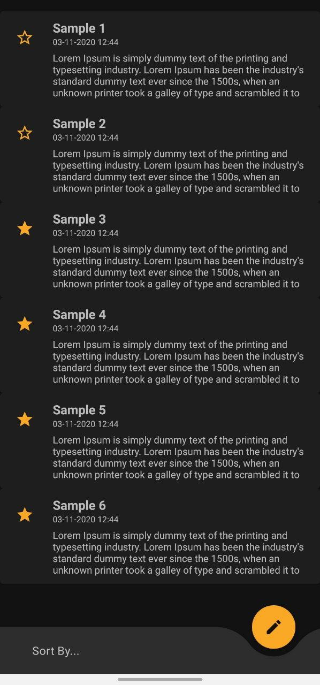
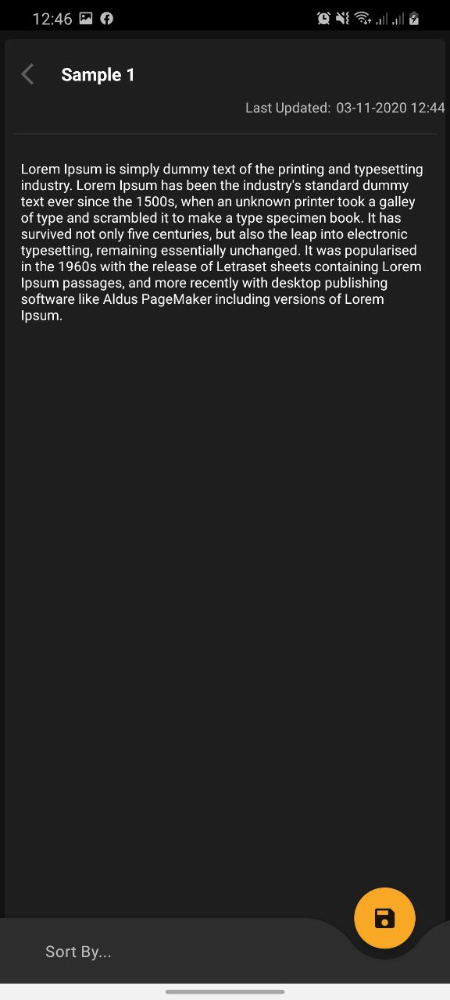
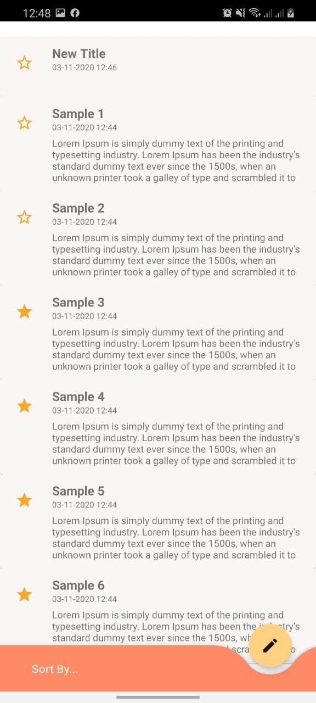

# KTNotes

Simple Note - Android Application

## Overview

Code Sample - A Basic Application to `create`, `edit` and `view` your notes.

- Users can track their notes from the dashboard.
- Users can create a new note from the dashboard.
- Users can edit an existing note by clicking on a note card.

## Screenshots

## Technologies

- Applying Android Architecture Components(MVVM, LiveData) + RoomDB & RxJava2
- Android Navigation Components
- Beautiful Material Design & Night Mode.

## Installation Guide (Windows, MacOS, Linux)

- Download/Clone the code.
- Using ![Android Studio] (<https://developer.android.com/studio>) to open the downloaded project.
- Will take a few minutes to initialize the project.
- Connect your Android Device
- Simply click on Run/Debug Button to run the application on your local device.

## Future Enhancement

- Adding folder list. 
- Adding Material Motion.
- More Improvements.